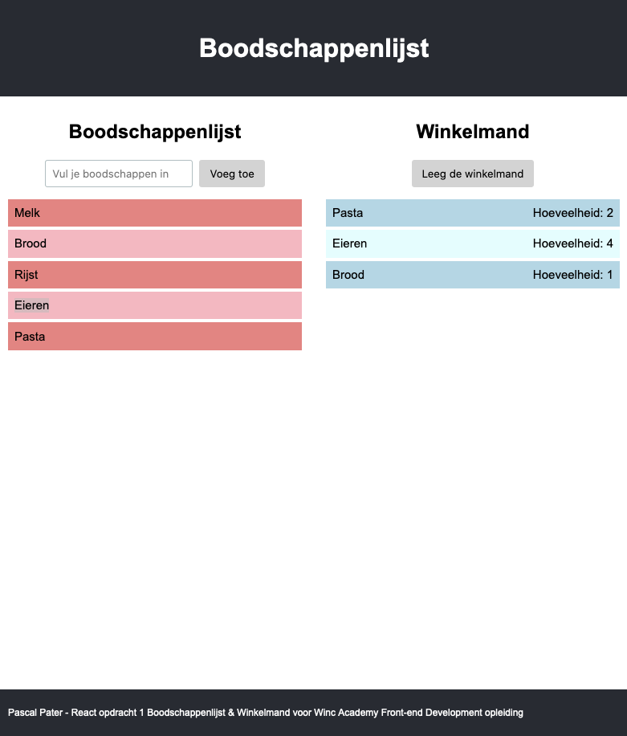

# React Opdracht - Boodschappenlijst & Winkelmand

## Versies
Deze opdracht is in eerste instantie gemaakt met gebruik van setState en class components. Deze versie staat hier op de main branch.

Om meer te oefenen met React, heb ik deze opdracht vervolgens ook gemaakt met functionele components en de useState hook en met het gebruik van useContext en custom hooks.
Deze versie staan op de volgende branches:
- Functionele components en de useState hook: [useState-hook-version](https://github.com/PasquinelP/L33-React-my-groceries-app/tree/useState-hook-version)
- useContext en custom hook: [useContext-version](https://github.com/PasquinelP/L33-React-my-groceries-app/tree/useContext-version)

## Introductie

In deze opdracht ga je een winkelmand maken waar je items aan kunt toevoegen vanaf je boodschappenlijst. De opdracht is opgedeeld in verschillende delen, die steeds een stuk moeilijker worden en minder expliciet.

- Deel 1: Maak een boodschappenlijst
- Deel 2: Maak de items een los component
- Deel 3: Render de items dynamisch
- Deel 4: Winkelmand

    - Als gebruiker wil ik items in mijn boodschappenlijst aan kunnen klikken en toevoegen aan mijn winkelmand.
    - Als gebruiker wil ik mijn winkelmand kunnen legen met een klik op een delete button

- Deel 5: Maak een InputField om boodschappen toe te voegen aan je boodschappenlijst.

    - Als gebruiker wil ik boodschappen toe kunnen voegen aan mijn boodschappenlijst.
- Deel 6: Toon dubbele winkelmand items met de tekst "hoeveelheid: 3" in de winkelmand.

    - Als gebruiker wil ik, wanneer ik 2 of meer van dezelfde items toevoeg aan mijn winkelmand, zien dat de hoeveelheid van de items omhoog gaat.

Screenshot:

